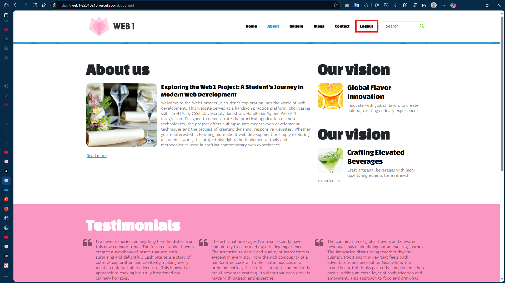
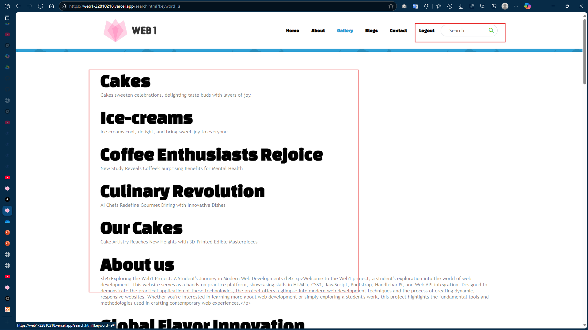
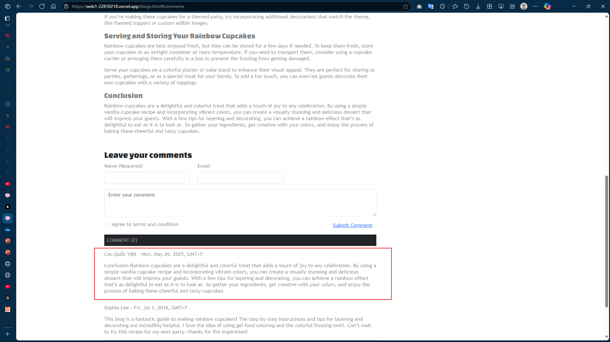

# web1-22810218
Đồ án môn học web1 - HCMUS

## Các chức năng đã hoàn thành

### 1. Xác thực người dùng
- Đăng nhập và xác thực token
- API endpoint: `/users/authenticate`, `/users/verify`

### 2. Tìm kiếm
- Tìm kiếm dữ liệu theo từ khóa
- API endpoint: `/api/search`

### 3. Gửi email liên hệ
- Gửi email thông qua form liên hệ
- API endpoint: `/users/send`

### 4. Bình luận blog
- Thêm bình luận vào bài viết
- API endpoint: `/users/comment`

### 5. Các chức năng GET Data khác
- Lấy dữ liệu từ các endpoint:
  - `/api/:type`
  - `/api/:type/:id`
  - `/api/:type/categories/:catId`
  - `/api/blogs?page=n`
  - `/api/blogs/categories/:id?page=n`
  - `/api/blogs/archives/:month-:year?page=n`

Tất cả các chức năng API đã được triển khai đầy đủ và hoạt động tốt trong đồ án.